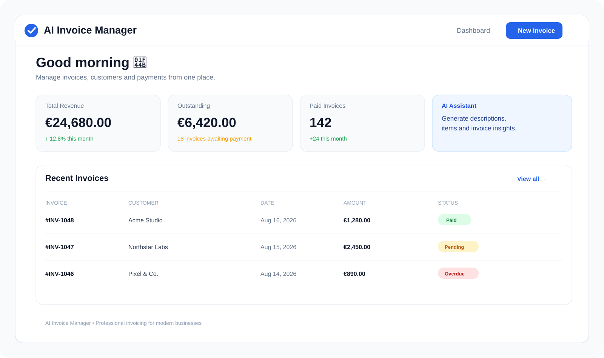

# AI Invoice Manager

<p align="center">
  <strong>Modern invoicing, powered by AI.</strong><br />
  Create professional invoices, manage customers, track payments, and streamline your billing workflow from one elegant workspace.
</p>

<p align="center">
  <a href="https://github.com/robson-muniz/ai-invoice-manager">Repository</a>
  ·
  <a href="https://github.com/robson-muniz/ai-invoice-manager/issues">Issues</a>
</p>

<p align="center">
  
  
  
  
  
</p>

<br />

<p align="center">
  
</p>

## ✦ Overview

**AI Invoice Manager** is a full-stack SaaS application designed to make invoicing feel less like administration and more like a product experience.

The platform brings the core billing workflow into one place: create polished invoices, manage customers, monitor payment status, generate PDFs, and use AI assistance to speed up invoice creation.

It is built as a portfolio-grade SaaS project with a production-oriented architecture, authentication, database persistence, payments, validation, testing, and a modern Next.js application layer.

## ✨ Highlights

| | Capability | What it does |
| --- | --- | --- |
| 📄 | **Professional Invoices** | Create structured, branded invoices ready to send to customers. |
| 🤖 | **AI Assistance** | Generate service descriptions and invoice items faster with AI-powered assistance. |
| 👥 | **Customer Management** | Keep customer information organized alongside billing activity. |
| 💳 | **Payments** | Stripe integration provides the foundation for subscription and payment workflows. |
| 📊 | **Billing Dashboard** | See revenue, outstanding invoices, paid invoices, and recent activity at a glance. |
| 📬 | **Email Delivery** | Nodemailer integration supports invoice and transactional email workflows. |
| 📑 | **PDF Generation** | Generate professional invoice documents with PDFKit. |
| 🔐 | **Authentication** | NextAuth with Prisma provides the authentication foundation. |
| 🧪 | **Testing** | Vitest and Testing Library are included for reliable application behavior. |

## 🧱 Tech Stack

### Frontend

- **Next.js 16** with the App Router
- **React 19**
- **TypeScript**
- **Tailwind CSS 4**
- **Radix UI** primitives
- **React Hook Form + Zod** for forms and validation
- **TanStack React Query** for client-side data management
- **Lucide React** for interface icons

### Backend & Data

- **Next.js server architecture**
- **Prisma ORM**
- **PostgreSQL-compatible database setup**
- **NextAuth** authentication
- **bcryptjs** password hashing
- **Zod** schema validation
- **Nodemailer** email delivery
- **PDFKit** invoice PDF generation

### Payments & Quality

- **Stripe** for payments and billing
- **Vitest** for testing
- **Testing Library** for UI tests
- **ESLint** for code quality
- **TypeScript strict type checking**

## 🏗️ Architecture

The application follows a modular full-stack structure designed to keep business logic, UI concerns, persistence, and integrations separated as the product grows.

```text
┌─────────────────────────────────────────────────────────────┐
│                     Next.js Application                     │
├───────────────────────────────┬─────────────────────────────┤
│        Presentation           │       Server / API          │
│                               │                             │
│  React + Tailwind + Radix     │  Auth + Validation + Logic  │
│  Forms + React Query           │  Invoice + Customer Flows  │
├───────────────────────────────┴─────────────────────────────┤
│                         Data Layer                           │
│                   Prisma + PostgreSQL                       │
├─────────────────────────────────────────────────────────────┤
│                       Integrations                           │
│             Stripe · Nodemailer · PDFKit · AI               │
└─────────────────────────────────────────────────────────────┘
```

## 🚀 Getting Started

### Prerequisites

Make sure you have:

- Node.js 20+
- npm, pnpm, yarn, or Bun
- A PostgreSQL database
- The required environment variables configured

### 1. Clone the repository

```bash
git clone https://github.com/robson-muniz/ai-invoice-manager.git
cd ai-invoice-manager
```

### 2. Install dependencies

```bash
npm install
```

### 3. Configure environment variables

Create a local environment file:

```bash
cp .env.example .env
```

Then configure your database, authentication, Stripe, email, and AI credentials according to the variables defined by the project.

> **Security:** Never commit `.env` files or production secrets to the repository.

### 4. Set up the database

```bash
npm run db:push
```

For migration-based development:

```bash
npm run db:migrate
```

If seed data is available for your environment:

```bash
npm run db:seed
```

### 5. Start the development server

```bash
npm run dev
```

Open **http://localhost:3000** in your browser.

## 🧰 Development Commands

| Command | Purpose |
| --- | --- |
| `npm run dev` | Start the development server |
| `npm run build` | Create a production build |
| `npm run start` | Start the production server |
| `npm run lint` | Run ESLint |
| `npm run type-check` | Run TypeScript checks |
| `npm run test` | Run the test suite |
| `npm run test:ui` | Open the Vitest UI |
| `npm run db:push` | Push Prisma schema changes to the database |
| `npm run db:migrate` | Create and apply Prisma migrations |
| `npm run db:seed` | Seed the database |

## 📁 Project Structure

```text
ai-invoice-manager/
├── prisma/                 # Database schema, migrations and seed data
├── public/                 # Static assets and project preview
├── src/
│   └── app/                # Next.js application routes and UI
├── .env.example            # Environment variable template
├── package.json            # Dependencies and scripts
└── README.md
```

## 💡 Product Workflow

```text
Create account
     ↓
Add customer
     ↓
Create invoice
     ↓
AI-assisted descriptions & items
     ↓
Generate professional PDF
     ↓
Send invoice
     ↓
Track payment status
     ↓
Review billing activity
```

## 🔒 Security & Reliability

The project includes several foundations expected from a modern SaaS application:

- Authentication and protected application flows
- Password hashing with bcrypt
- Runtime validation with Zod
- Database access through Prisma
- Type-safe TypeScript development
- Environment-based configuration
- Automated unit/UI testing infrastructure
- Linting and type checking in the development workflow

Production deployments should additionally use managed secrets, HTTPS, database backups, monitoring, rate limiting, and appropriate Stripe webhook verification.

## 🗺️ Roadmap

Potential product evolution includes:

- [ ] Recurring invoices
- [ ] Automated payment reminders
- [ ] Multiple currencies and localized tax rules
- [ ] Invoice templates and custom branding
- [ ] Advanced revenue analytics
- [ ] Team workspaces and roles
- [ ] Customer self-service portal
- [ ] More AI-powered billing automation

## 🤝 Contributing

Contributions, ideas, and bug reports are welcome.

1. Fork the repository
2. Create a feature branch
3. Make your changes
4. Run linting, type checks, and tests
5. Open a pull request

## 📄 License

This project is currently maintained as a personal portfolio/product project. If you intend to reuse the code commercially, check the repository for the applicable licensing terms before doing so.

## 👨‍💻 Author

**Robson Muniz**

React / Next.js Developer building modern SaaS products and developer-focused software.

<p align="center">
  <a href="https://github.com/robson-muniz">GitHub</a>
  ·
  <a href="https://robsonmuniz.tech">Portfolio</a>
</p>

---

<p align="center">
  <sub>Built with Next.js, TypeScript, Prisma, Stripe and a healthy obsession with good product UX.</sub>
</p>
